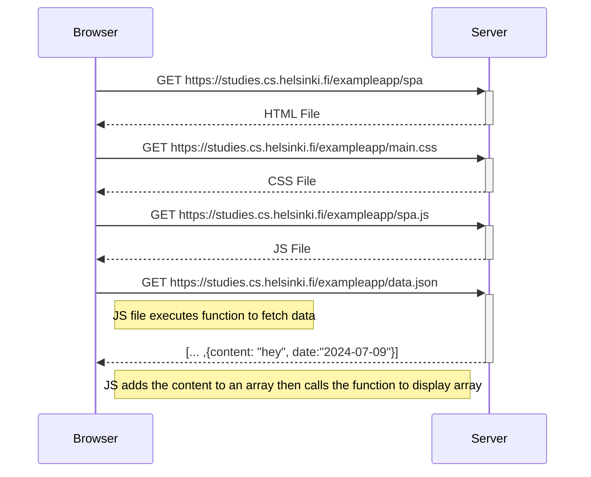

```mermaid
    sequenceDiagram
        participant Browser
        participant Server

        Browser->>+Server: GET https://studies.cs.helsinki.fi/exampleapp/spa
        Server-->>-Browser: HTML File
        Browser->>+Server: GET https://studies.cs.helsinki.fi/exampleapp/main.css
        Server-->>-Browser: CSS File
        Browser->>+Server: GET https://studies.cs.helsinki.fi/exampleapp/spa.js
        Server-->>-Browser: JS File
        Browser->>+Server: GET https://studies.cs.helsinki.fi/exampleapp/data.json
        Note right of Browser: JS file executes function to fetch data
        Server-->>-Browser:  [... ,{content: "hey", date:"2024-07-09"}]
        Note right of Browser: JS adds the content to an array then calls the function to display array
```
