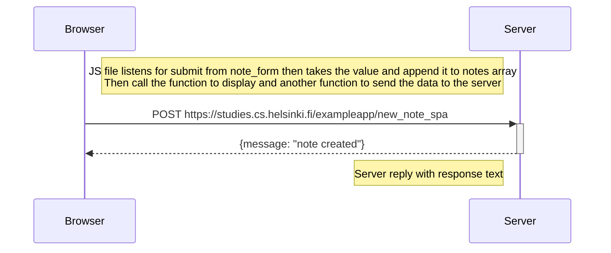

```mermaid
    sequenceDiagram
        participant Browser
        participant Server

        Note right of Browser: JS file listens for submit from note_form then takes the value and append it to notes array<br>Then call the function to display and another function to send the data to the server
        Browser->>+Server: POST https://studies.cs.helsinki.fi/exampleapp/new_note_spa
        Server-->>-Browser: {message: "note created"}
        Note left of Server: Server reply with response text

```
